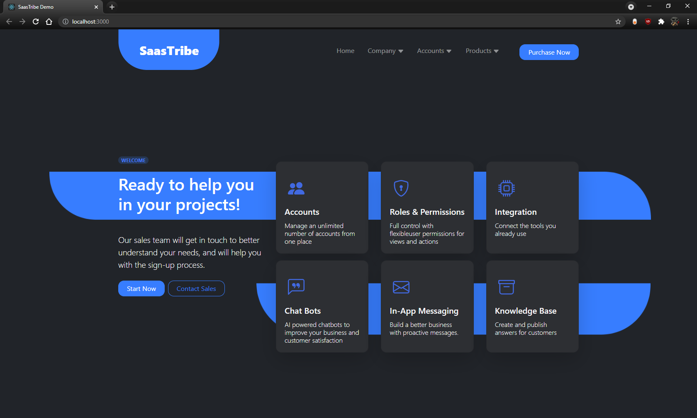
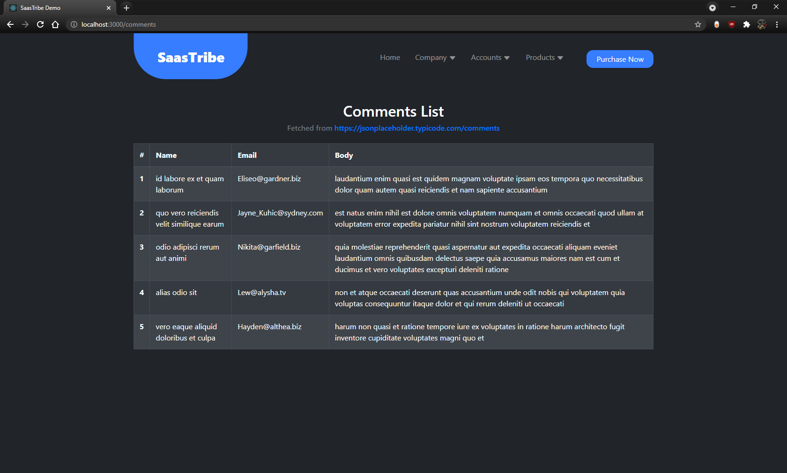

# A responsive React application

This is a front end app that uses React. It also uses `.scss` to configure styles & override some of the bootstrap default classes. There's also a route that consumes [a fake Rest API]([https://link](https://jsonplaceholder.typicode.com/comments)) & cleans up if the component unmounts.

## Usage:
- Run `npm install` 
- Open [http://localhost:3000](http://localhost:3000)

## Preview:

 

